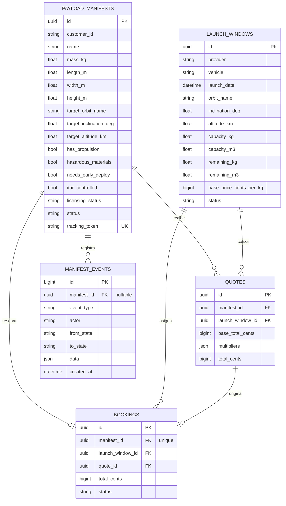
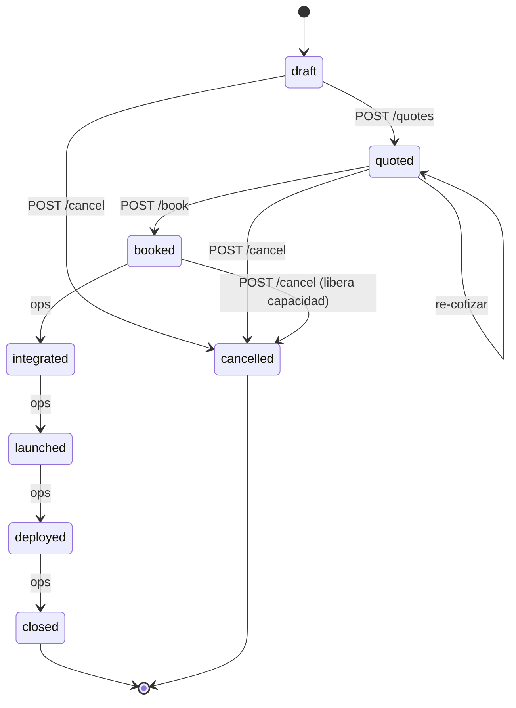

# ORBITA-LINK — Space Cargo Brokerage (MVP)

"DHL para el espacio": plataforma que agrega capacidad de lanzamiento de terceros (SpaceX Transporter, Rocket Lab, etc.) y permite a operadores de satélites pequeños (1–500 kg) reservar espacio fraccionable por kg y m³, con precio, fecha y tracking de extremo a extremo.

El objeto central del dominio es el **manifiesto digital del payload**: viaja intacto por todo el ciclo de vida (su identidad y su historial son independientes de cualquier reserva concreta) y está diseñado para extenderse en fases futuras a custodia física y transferencia orbital.

## Stack

- Python 3.12 + FastAPI (monolito modular: `catalog`, `manifests`, `matching`, `pricing`, `booking`, `tracking` — cada módulo con su router, servicio y repositorio)
- PostgreSQL + SQLAlchemy 2.0 + Alembic (los tests corren sobre SQLite en memoria)
- Pydantic v2 en todos los contratos; OpenAPI automática en `/docs`; API versionada bajo `/api/v1`
- JWT con dos roles (`customer`, `ops`); el emisor de tokens de desarrollo se apaga con `ORBITA_ENABLE_DEV_AUTH=false` al delegar en un IdP externo
- Dinero **siempre en centavos de USD enteros**; timestamps **siempre UTC**

## Levantar el entorno

### Con Docker (recomendado)

```bash
docker compose up --build
```

Levanta Postgres, aplica migraciones (`alembic upgrade head`), ejecuta el seed (3 lanzamientos + 5 payloads, imprime sus tracking tokens en el log) y sirve la API en http://localhost:8000. OpenAPI en http://localhost:8000/docs.

### Local sin Docker

```bash
python3.12 -m venv .venv && source .venv/bin/activate
pip install -e ".[dev]"
cp .env.example .env            # ajusta ORBITA_DATABASE_URL a tu Postgres
alembic upgrade head
python -m scripts.seed
uvicorn app.main:app --reload
```

### Tests

```bash
pytest
```

Cubren los flujos críticos: matching, pricing, máquina de estados (toda transición inválida falla con error explícito y HTTP 409), flujo completo de reserva, liberación de capacidad al cancelar, y fronteras de autorización.

## Modelo de datos



`manifest_events` es **append-only**: la aplicación solo hace INSERT; no existe (ni debe existir) ruta de update/delete. Todo evento de dominio (creación, cotización, reserva, cambio de estado) se publica en un bus in-process (`app/domain/events.py`) cuyo único suscriptor del MVP persiste en esta tabla dentro de la misma transacción del caso de uso — el bus es la costura para notificaciones y sistemas físicos futuros.

## Máquina de estados del manifiesto

Implementada como tabla de transiciones explícita en `app/domain/state_machine.py` — no hay ifs dispersos. Toda transición inválida lanza `InvalidTransitionError` (HTTP 409).



`cancelled` solo es alcanzable **antes** de `integrated`: una vez integrado físicamente al vehículo no hay cancelación unilateral. Cancelar una reserva activa devuelve la masa y el volumen a la ventana de lanzamiento.

## Motores intercambiables

- **Matching** (`app/modules/matching/engine.py`): protocolo `MatchingEngine`; la v1 compara inclinación ±1.5° y altitud ±50 km (tolerancias en config) y verifica capacidad restante. La interfaz recibe el manifiesto completo y las ventanas candidatas, de modo que un motor de delta-v de transferencia se conecta sin tocar a los llamadores. Ranking determinista: score orbital desc → fecha asc → precio asc.
- **Pricing** (`app/modules/pricing/engine.py`): protocolo `PricingEngine`; la v1 aplica `tarifa base × kg × multiplicadores`. Los multiplicadores (urgencia, volumen atípico por baja densidad, riesgo regulatorio por hazmat/licencias/ITAR) viven en variables de entorno, no en código.

## Flujo completo con curl

```bash
BASE=http://localhost:8000/api/v1

# 0. Tokens (dev). En producción los emite el IdP.
CUST=$(curl -s -X POST $BASE/auth/dev-token -H 'Content-Type: application/json' \
  -d '{"subject":"acme-earth-obs","role":"customer"}' | jq -r .access_token)
OPS=$(curl -s -X POST $BASE/auth/dev-token -H 'Content-Type: application/json' \
  -d '{"subject":"ops-ana","role":"ops"}' | jq -r .access_token)

# 1. Registrar el payload (draft). Guarda id y tracking_token de la respuesta.
curl -s -X POST $BASE/manifests -H "Authorization: Bearer $CUST" -H 'Content-Type: application/json' -d '{
  "name": "AcmeSat-3", "mass_kg": 50,
  "length_m": 0.6, "width_m": 0.4, "height_m": 0.4,
  "target_orbit_name": "SSO", "target_inclination_deg": 97.5, "target_altitude_km": 545,
  "licensing_status": "pending"
}'
MID=<id>; TOKEN=<tracking_token>

# 2. Matching: ventanas compatibles rankeadas con precio estimado y desglose.
curl -s $BASE/manifests/$MID/matches -H "Authorization: Bearer $CUST"

# 3. Cotizar contra una ventana (draft -> quoted). Guarda el quote id.
curl -s -X POST $BASE/manifests/$MID/quotes -H "Authorization: Bearer $CUST" \
  -H 'Content-Type: application/json' -d '{"launch_window_id": "<window_id>"}'
QID=<quote_id>

# 4. Reservar (quoted -> booked; descuenta kg y m3 de la ventana).
curl -s -X POST $BASE/manifests/$MID/book -H "Authorization: Bearer $CUST" \
  -H 'Content-Type: application/json' -d "{\"quote_id\": \"$QID\"}"

# 5. Ops avanza el ciclo de vida. Saltarse un estado responde 409.
for S in integrated launched deployed closed; do
  curl -s -X POST $BASE/manifests/$MID/status -H "Authorization: Bearer $OPS" \
    -H 'Content-Type: application/json' -d "{\"to_state\": \"$S\"}"
done

# 6. Tracking público: estado e historial completo, sin header de auth.
curl -s $BASE/tracking/$TOKEN
```

## Deudas técnicas asumidas

1. **Concurrencia de reservas**: la sobreventa se previene con `SELECT ... FOR UPDATE` sobre la ventana al reservar; suficiente en el monolito, pero al extraer booking a servicio propio hará falta reserva de capacidad con expiración (hold + confirm) en lugar de lock de fila.
2. **Cotizaciones sin expiración**: una quote puede reservarse días después al precio viejo. Falta `expires_at` y re-validación de precio al reservar.
3. **Event log como única proyección**: el bus de eventos es síncrono e in-process; no hay outbox ni redelivery. Antes de integrar notificaciones o sistemas físicos hay que pasar a transactional outbox + broker.
4. **Auth mínima**: el emisor dev de JWT no valida identidad; no hay refresh tokens ni revocación. El diseño ya delega la emisión a un IdP (la app solo verifica), pero falta la integración real (JWKS, issuer/audience).
5. **Matching v1 ingenuo**: tolerancia plana de inclinación/altitud; ignora RAAN, ventanas de fase y capacidad de propulsión del propio payload para cerrar el gap orbital. La interfaz ya lo contempla (recibe el manifiesto completo).
6. **Masas y volúmenes en float**: el dinero es entero (centavos), pero kg/m³ usan float; para facturación fina convendría `Numeric`.
7. **Tipos portables SQLite/Postgres**: para que los tests corran en SQLite se usan `JSON`/`Uuid` genéricos en vez de `JSONB`/índices GIN de Postgres.
8. **Sin paginación** en listados; irrelevante con volúmenes MVP.

### Primer módulo a extraer como microservicio: `matching`

Es el candidato correcto porque (a) es **stateless**: lee catálogo y manifiesto, no escribe nada, así que la extracción no exige transacciones distribuidas; (b) es el módulo con la **evolución algorítmica más agresiva** (delta-v, propagación orbital, optimización multi-ventana), con ciclo de despliegue y perfil de cómputo distintos al CRUD; y (c) sus dependencias ya son contratos limpios (`MatchingEngine`/`PricingEngine` como protocolos + repositorio de solo lectura), de modo que la costura de red se coloca donde hoy hay una interfaz en memoria. `booking`, en cambio, debe quedarse cerca de `manifests` mientras compartan la transacción capacidad+estado.

## Estructura del repositorio

```
app/
├── main.py                  # app factory; registra routers /api/v1 y el suscriptor del event log
├── config.py                # pydantic-settings: tolerancias, multiplicadores, JWT, DB
├── database.py              # engine, sesión, Base
├── auth/                    # verificación JWT, roles, emisor dev
├── domain/
│   ├── state_machine.py     # tabla de transiciones + InvalidTransitionError
│   └── events.py            # DomainEvent + EventBus in-process
└── modules/
    ├── catalog/             # CRUD de ventanas de lanzamiento (ops)
    ├── manifests/           # manifiesto del payload + event log (append-only)
    ├── matching/            # Protocol + V1ToleranceMatcher
    ├── pricing/             # Protocol + V1MultiplierPricing
    ├── booking/             # quotes, reservas, cancelación, avance de estados
    └── tracking/            # endpoint público por token
alembic/                     # migraciones (0001: esquema inicial)
scripts/seed.py              # 3 lanzamientos + 5 payloads de ejemplo
tests/                       # matching, pricing, máquina de estados, flujo e2e
```
